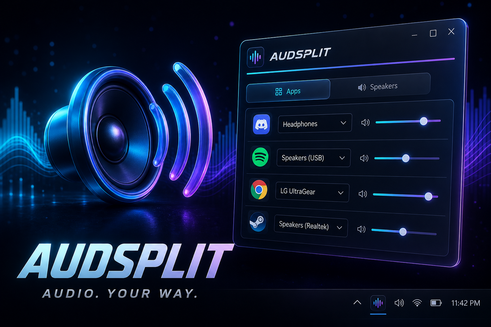

# AUDSPLIT

<p align="center">
  
</p>

<p align="center"><strong>AUDIO. YOUR WAY.</strong></p>

Per-app audio output routing for Windows. Send Spotify to Bluetooth headphones, Meet to wired cans, and games to speakers — at the same time.

Uses the same Windows mechanism as **Settings → System → Sound → Volume mixer** (`IAudioPolicyConfigFactory`).

## Features

- **Per-app output routing** — pick a device for each playing app
- **Per-speaker volume + mute** — control each endpoint, not just the system default
- **System tray flyout** — Apps / Speakers pages, stays out of the way
- **Persisted routes** — Windows remembers assignments across restarts

## Download

Grab the latest Windows build from **[Releases](https://github.com/vincentperezzz/Audsplit/releases)**.

Unzip → run `AUDSPLIT.exe` → flyout opens; thereafter left-click the tray icon.

Requires **Windows 10 1809+** or **Windows 11**. The release build is self-contained (no separate .NET install).

## Usage

1. AUDSPLIT lives in the **system tray**.
2. **Left-click** the tray icon to open the flyout.
3. **Apps** — start audio in the apps you want, hit **Refresh**, pick an output (or System default).
4. **Speakers** — set volume / mute per device.
5. **Reset all** clears every persisted per-app route.

Right-click tray: Open / Refresh / Exit.

## Build from source

Requirements: [.NET 8 SDK](https://dotnet.microsoft.com/download/dotnet/8.0)

```powershell
dotnet build AUDSPLIT.sln -c Release
dotnet run --project src/AUDSPLIT -c Release
```

Smoke-test APIs (no UI):

```powershell
dotnet run --project src/AUDSPLIT -c Release -- --smoke
```

Publish a self-contained exe:

```powershell
dotnet publish src/AUDSPLIT/AUDSPLIT.csproj -c Release -r win-x64 --self-contained true -p:PublishSingleFile=true -o artifacts/publish
```

## Notes

- Routes are persisted by Windows and survive restarts.
- Some apps only pick up a new device after their stream restarts (pause/play, rejoin Meet).
- Only apps with an active or recent audio session appear.

## License

MIT. AudioPolicyConfig approach adapted from [EarTrumpet](https://github.com/File-New-Project/EarTrumpet) (MIT).
